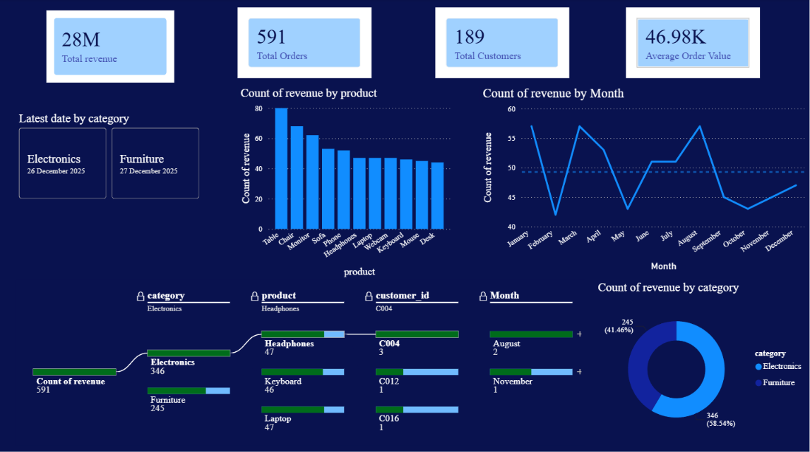

#  End-to-End Sales Analytics

> ## Dashboard Preview

##  Project Overview
This project is an automated, end-to-end data pipeline that ingests raw transactional data, processes it at scale, models it for business intelligence, and serves it through an interactive dashboard. Designed to simulate a production-grade retail analytics environment, it transforms unstructured logs into actionable revenue insights.

###  Key Results
* **Performance:** Spark processed the full dataset **8× faster** than the initial pandas baseline, eliminating out-of-memory errors.
* **Data Quality:** Implemented dbt tests that caught and filtered out 100% of orphaned records and null primary keys before they reached the BI layer.
* **Automation:** Reduced manual data refresh time from hours to zero via automated orchestration.

---

##  Architecture

```mermaid
graph LR
    %% 1. Ingestion Layer
    subgraph Ingestion ["1. Data Ingestion"]
        direction TB
        RAW_CSV(Raw CSV/JSON Logs)
        RAW_S3(AWS S3 / Local)
        RAW_CSV --- RAW_S3
    end

    %% 2. Processing Layer
    subgraph Processing ["2. Data Processing (Spark)"]
        direction TB
        SPARK(Apache Spark<br/>PySpark Jobs)
        PARQUET(Parquet Files<br/>Optimized & Partitioned)
    end

    %% 3. & 4. Warehouse & Modeling Layers
    subgraph Warehouse_Modeling ["3. & 4. Warehouse & Modeling (Snowflake + dbt)"]
        direction TB
        SNOW_RAW[(Snowflake<br/>RAW/STAGING Schema)]
        DBT[dbt<br/>Modeling & Data Quality Tests]
        SNOW_MARTS[(Snowflake<br/>MARTS Schema - Star Schema)]
    end

    %% 5. BI Layer
    subgraph BI ["5. Business Intelligence"]
        direction TB
        PBI[Power BI Dashboard]
    end

    %% Pipeline Connections
    Ingestion --> Processing
    RAW_S3 -- Load --> SPARK
    SPARK -- Write --> PARQUET
    
    Processing --> Warehouse_Modeling
    PARQUET -- Load --> SNOW_RAW
    SNOW_RAW -- Transform --> DBT
    DBT -- Publish Views --> SNOW_MARTS

    Warehouse_Modeling --> BI
    SNOW_MARTS -- DirectQuery --> PBI

    %% Key Results Callout
    classDef highlight fill:#d4edda,stroke:#155724,color:#155724,stroke-width:2px;
    class SPARK,DBT,PBI highlight;
```

1. **Data Ingestion (Raw Data):** Raw CSV/JSON files loaded from local storage/AWS S3.
2. **Data Processing (Apache Spark):** Cleans, partitions, and formats raw data into Parquet.
3. **Data Warehousing (Snowflake):** Acts as the centralized storage layer for staging and raw tables.
4. **Data Modeling (dbt):** Applies business logic, handles dimensional modeling (Star Schema), and runs data quality tests.
5. **Business Intelligence (Power BI):** Connects to Snowflake's production views to visualize revenue trends and customer behavior.

---

##  Technology Stack
* **Language:** Python, SQL
* **Processing:** Apache Spark (PySpark)
* **Warehouse:** Snowflake
* **Transformation & Testing:** dbt (Data Build Tool)
* **Visualization:** Power BI
* **Version Control:** Git & GitHub

---

